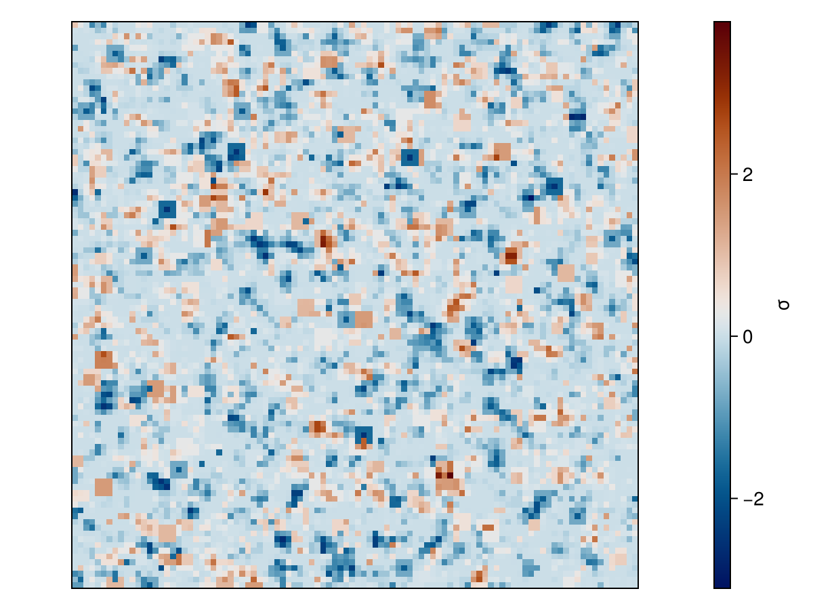

# MinkowskiFunctionals

[](https://github.com/markuspirke/MinkowskiFunctionals.jl/actions/workflows/CI.yml?query=branch%3Amain)
[](https://markuspirke.github.io/MinkowskiFunctionals.jl/dev/)

**MinkowskiFunctionals.jl** is a Julia package for calculating 2D Minkowski functionals.

Minkowski functionals offer a powerful method for characterizing the shape, size, and connectivity of structures in binary images, without relying on overly detailed descriptions and assumptions.

This package allows users to compute the functionals area, perimeter, and Euler characteristic. It can generate the exact distributions with an "brute force approach", by essentially going through all possible black and white images (not advised to try out on images larger than 6 x 6 pixels). The following [https://arxiv.org/pdf/1710.03542](paper) describes a method which can be used to sample distributions for even larger images accurately. The authors also have a [https://github.com/michael-klatt/minkmaps](repository) where distributions for images up to 15 x 15 pixels are stored. These can be downloaded and also used in this framework.

## Installation Guide

1. Download the latest Julia version ([latest release](https://julialang.org/downloads/) or [via juliaup](https://github.com/JuliaLang/juliaup))
2. Open a terminal and hit **julia**. This will open a **Julia REPL**.
3. Inside the REPL hit ]. This will open up the Julia package manager. Then type **add MinkowskiFunctionals**.
```julia
julia>]
(v1.8) pkg> add MinkwoskiFunctionals
```

## Basic Usage

### Minkowski functionals for a black and white image
```julia
using MinkowskiFunctionals
img = rand(Bool, 10, 10)
result = MinkowskiFunctional(img)
```
### Minkowski skymaps from count maps
```julia
counts_map = CountsMap(100, 10.0)
background = 10.0
dos = DensityOfStates(3)
mink_map = MinkowskiMap(counts_map, background, dos)
```
For window sizes larger than 5 the density of states has to loaded [https://github.com/michael-klatt/minkmaps](here) like this `dos = DensityOfStates(path/to/structure_11x11)`.

We can also make a plot of the Minkoski skymap, by loading **CairoMakie**, which then automatically loads the extensions.
```julia
using CairoMakie
fig, ax, hm = heatmap(mink_map)
current_figure()
```


